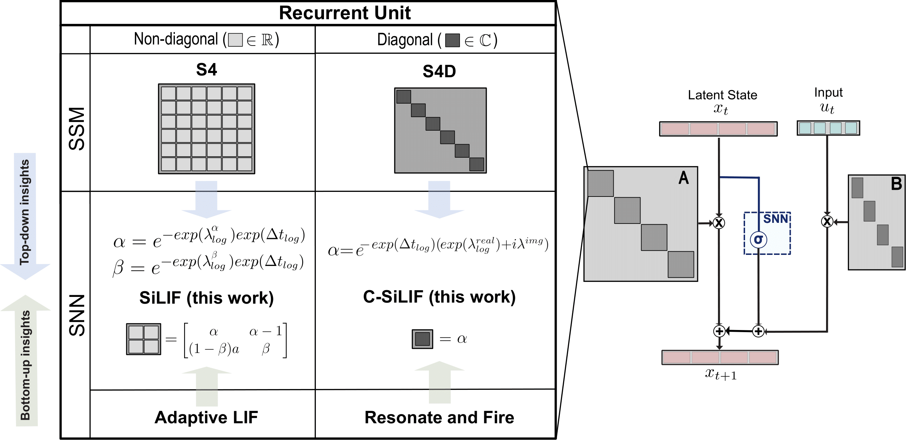

<!--
Copyright (c) 2025 Maxime Fabre and Lyubov Dudchenko
This file is part of SSM-inspired-LIF, released under the MIT License.

Modified from: https://github.com/idiap/sparch
Original license: BSD 3-Clause (see third_party/sparch/LICENSE)

SPDX-FileCopyrightText: © 2022 Idiap Research Institute <contact@idiap.ch>
SPDX-FileContributor: Alexandre Bittar <abittar@idiap.ch>
SPDX-License-Identifier: BSD-3-Clause

This file was originally part of the sparch package.
--->

# SSM-inspired-LIF

Official implementation of the SiLIF and C-SiLIF models from the paper "Structured State Space Model Dynamics and Parametrization for Spiking Neural Networks". This repository builds upon the [SpArch](https://github.com/idiap/sparch.git) repository introduced by A. Bittar and P. Garner in [A Surrogate Gradient Spiking Baseline for Speech Command Recognition](https://doi.org/10.3389/fnins.2022.865897).




## Requirements

This code is based on Pytorch. To install required libraries, do:

```setup
pip install -r requirements.txt
```

Additionally, the three following datasets need to be downloaded and ideally placed in a `/data` folder inside the main repo:

- The Spiking Heidelberg Digits (SHD) dataset containing spoken digits from 0 to 9 in both English and German (20 classes). The train and test sets contain 8332 and 2088 examples respectively (there is no validation set).

- The Spiking Speech Commands (SSC) dataset based on the Google Speech Commands v0.2 dataset and contains 35 classes from a larger number of speakers. The number of examples in the train, validation and test splits are 75466, 9981 and 20382 respectively.

Both these data sets employ the cochlea model developed by [Cramer et al. (2020)](https://doi.org/10.1109/TNNLS.2020.3044364) to convert audio waveforms to a train of events and can be downloaded from the [Zenke Lab website](https://zenkelab.org/resources/spiking-heidelberg-datasets-shd/).

- The second version of the (non-spiking) Google Speech Command (GSC) data set, introduced by [Warden (2018)](https://arxiv.org/abs/1804.03209), which can be found on the [TensorFlow website](https://www.tensorflow.org/datasets/catalog/speech_commands).


## Models

The repository includes the new models introduced in this work along with previous models already integrated in SpArch. 
We keep the ANN models from SpArch but mostly focus on the SNN ones present in `models/snns.py`:

- SiLIF: SSM-inspired LIF neurons with timestep training and log reparametrization
- CSiLIF: Complex-valued SSM-inspired LIF neurons with the SiLIF features plus S4D-Lin initialization from the [S4 model](https://arxiv.org/abs/2111.00396)
- CadLIF: Reproduced implementation of the constrained AdLIF model introduced by [Deckers et. al. (2024)](https://www.frontiersin.org/journals/neuroscience/articles/10.3389/fnins.2024.1360300/full)
- ResonateFire (RF): Reproduced reference resonate and fire model following the work by [Higuchi et. al. (2024)](https://arxiv.org/abs/2402.14603) 

Plus all the models already available in SpArch
- LIF: LIF neurons without layer-wise recurrent connections
- RLIF: LIF neurons with layer-wise recurrent connections
- adLIF: adaptive LIF neurons without layer-wise recurrent connections
- RadLIF: adaptive LIF neurons with layer-wise recurrent connections.


## Training

To train any of these models, run this command:

```train
cd SSM-inspired-LIF
python main.py --model_type <model_name> --dataset_name <shd/ssc/sc> \
    --data_folder <path_to_data> --new_exp_folder <path_to_output>
```

This will trigger a wandb sweep with 5 runs of different seeds that saves the best model in the experiment folder by default.
If you do not wish to use wandb, you can simply add the argument `--debug` which will only run 1 seed.


We also implement configurations to reproduce results with the best obtained hyperparameters which can be found in `/configs`.
For instance to reproduce training for SiLIF results on 4ms SSC, one can simply run:

```train with config
python main.py --config=ssc_silif_4ms.yaml
```
This counts on the datasets folders being in `/data` with the names SHD, SSC or GSC but else one can also precise `--data_folder` on top of the config file.

Additional available parameters like the number of epochs or timesteps can be found in `/parsers/model_config.py` and `/parsers/training_config.py`.
You can also select the GPU device to use with `--gpu_device #` (where `#` is the GPU index).

On average, training a model on a RTX 4090 GPU with 24 GB memory takes:
- 2 hours for the SHD dataset
- 15 hours for the SSC dataset
- 5 hours for the GSC dataset

## Evaluation

You can also run direct testing on pre-trained models with the argument `--evaluate_pretrained True`.

We provide reference pre-trained models for the 4ms SSC task obtained with seed 13 in `/reference_models`.
These can be tested directly with the corresponding configs. For instance for the SiLIF model, run:

```eval
python main.py --config=ssc_silif_4ms.yaml <model_name> --evaluate_pretrained True
```

This will run testing on the pre-trained model for 5 different testing seeds. Note that this leads to slightly different results than the ones reported in the paper as models are usually tested with the same seed they are trained on.


## Results

Our model achieves the following performance on the different datasets:

| Dataset | Method                     | Resolution | # Params | # Buffers | Top1 Accuracy       |
|---------|----------------------------|------------|----------|-----------|---------------------|
| SHD     | C-SiLIF, # hidden 128      | 4 ms       | 38.7k    | 0.5k      | 95.06 ± 0.37%       |
| SHD     | C-SiLIF, # hidden 512      | 4 ms       | 0.35M    | 2k        | 95.55 ± 0.28%       |
| SSC     | SiLIF, 10 ms bins          | 10 ms      | 0.35M    | 2k        | 80.11 ± 0.31%       |
| SSC     | C-SiLIF, 4 ms bins         | 4 ms       | 0.35M    | 2k        | 81.59 ± 0.31%       |
| SSC     | SiLIF, 4 ms bins           | 4 ms       | 0.35M    | 2k        | 82.03 ± 0.25%       |
| GSC     | SiLIF, # hidden 512        | 10 ms      | 0.3M     | 2k        | 95.25 ± 0.12%       |
| GSC     | SiLIF, # hidden 1024       | 10 ms      | 1.1M     | 4k        | 95.49 ± 0.09%       |


## Figure Reproduction

We additionally provide code to reproduce Figure 2 (eigenvalues distribution) of the paper and a partial version of Figure 3 (accuracy vs synaptic operations).

For this simply run:

```figure2
python figure2_eigenvalues.py
```
to recompute the eigenvalues of the provided pre-trained models and replot and save Figure 2 in `/figs`

OR

```figure3
python partial_figure3_synops.py
```

to partially reproduce Figure 3 for the SSC dataset and with only 1 seed model instead of 5. This explains why in this specific case (only seed 13 models provided), the C-SiLIF actually performs the best above the SiLIF one.

## License

This project is licensed under the MIT License. See the [LICENSE](./LICENSES/LICENSE) file for details.

## Contributing

Contributions are welcome! 
Please ensure your contributions align with the MIT license terms.